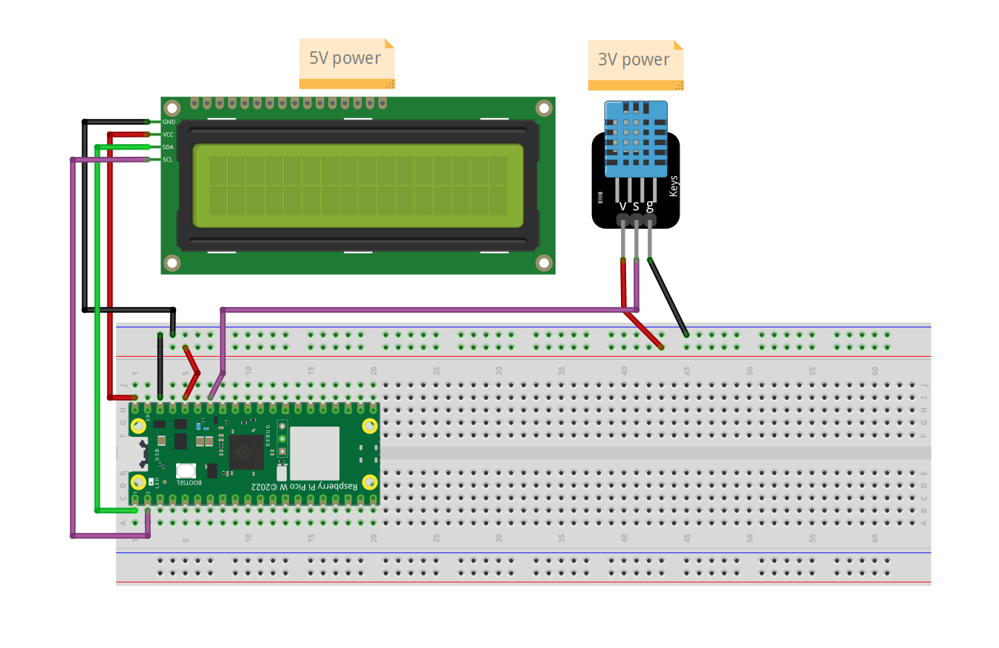

# Raspberry Pi Pico Temperature and Humidity Monitor

This project utilizes a Raspberry Pi Pico microcontroller along with a DHT11 sensor to measure temperature and humidity, displaying the readings on an LCD screen.

## Hardware
- Inland 1602 I2C LCD Display Module
- Inland DHT11 Temperature Humidity Moisture Sensor Module
- Raspberry Pi Pico

## Prerequisites

- Raspberry Pi Pico board
- DHT11 temperature and humidity sensor
- 20x4 I2C LCD screen
- MicroUSB cable for programming

## Wiring Diagram



## Installation

1. Connect the DHT11 sensor and the LCD screen to the Raspberry Pi Pico as per the wiring diagram.
2. Clone this repository to your Raspberry Pi Pico.

```bash
git clone https://github.com/your_username/pico-temperature-humidity-monitor.git
```

## Usage

- Ensure all connections are properly set up.
- Power on the Raspberry Pi Pico.
- The LCD screen will display the current temperature in Fahrenheit and humidity readings.
- The readings will automatically refresh every 5 seconds.

## Contributing

- Contributions are welcome! If you have any ideas for improvements or new features, feel free to open an issue or submit a pull request.

## Credits

The code for the DHT11 sensor interface (`dht.py`) was written by [Manodeep](https://www.instructables.com/DHT11-With-Raspberry-Pi-Pico/).
The code for the 1602 LCD (`pico_i2c_lcd.py`) was written by [T-622](https://github.com/T-622/RPI-PICO-I2C-LCD/blob/main/pico_i2c_lcd.py).
